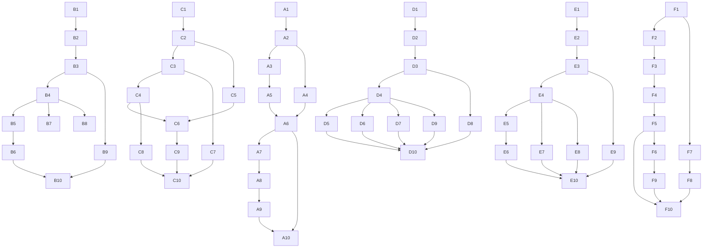

# Dependency Diagrams

## Mermaid

 ## ASCII

Track A (Nibbles)
A1 --> A2 --> A3 --> A5 --> A6 --> A7 --> A8 --> A9 --> A10
        --> A4 --> A6

Track B (Breakout)
B1 --> B2 --> B3 --> B4 --> B5 --> B6 --> B10
                 --> B7
                 --> B8
B3 --> B9

Track C (Gorillas)
C1 --> C2 --> C3 --> C4 --> C6 --> C9 --> C10
        --> C5 --> C6
C3 --> C7 --> C10
C4 --> C8 --> C10

Track D (President)
D1 --> D2 --> D3 --> D4 --> D5 --> D10
                 --> D6 --> D10
                 --> D7 --> D10
D3 --> D8 --> D10
D4 --> D9 --> D10

Track E (Tetris)
E1 --> E2 --> E3 --> E4 --> E5 --> E6 --> E10
E4 --> E7 --> E10
E4 --> E8 --> E10
E3 --> E9 --> E10

Track F (Metroid-like)
F1 --> F2 --> F3 --> F4 --> F5 --> F10
F5 --> F6 --> F9 --> F10
F1 --> F7 --> F8 --> F10
